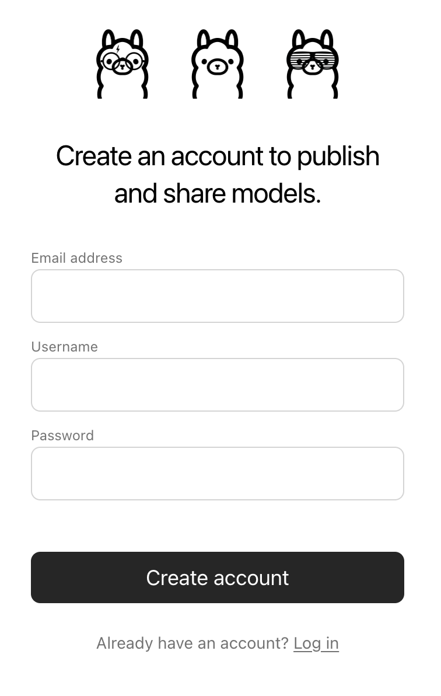
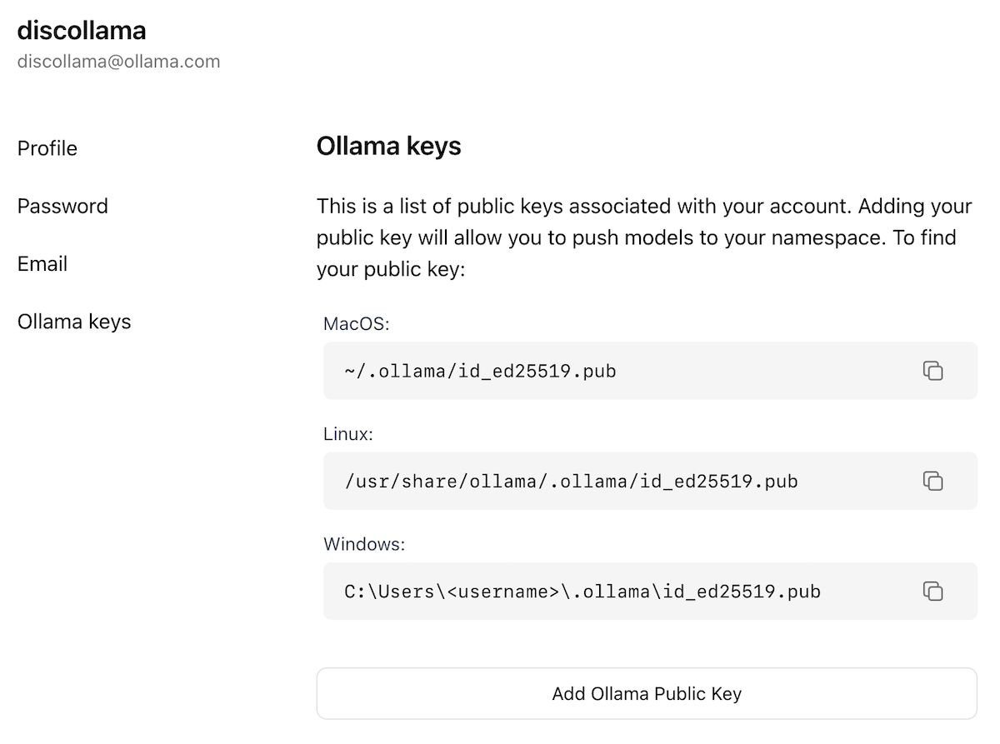

## Table of Contents

- [Importing a Safetensors model](#importing-a-model-from-safetensors-weights)
- [Importing a GGUF model](#importing-a-gguf-model)
- [Sharing models on ollama.com](#sharing-your-model-on-rose-com)

## Importing a model from Safetensors weights

First, create a `Modelfile` with a `FROM` command which points to the directory containing your Safetensors weights:

```dockerfile
FROM /path/to/safetensors/directory
```

If you create the Modelfile in the same directory as the weights, you can use the command `FROM .`.

Now run the `rose create` command from the directory where you created the `Modelfile`:

```shell
rose create my-model
```

Lastly, test the model:

```shell
rose run my-model
```

## Importing a GGUF model

Rose does not quantize GGUF models during import. Prepare and quantize them first with a GGUF tool such as llama.cpp's [`llama-quantize`](https://github.com/ggml-org/llama.cpp/tree/master/tools/quantize).

To import a single-file GGUF model, create a `Modelfile` containing:

```dockerfile
FROM /path/to/file.gguf
```

For a split GGUF model, keep the original split filenames and use a wildcard that matches every shard.

```dockerfile
FROM /path/to/model-*.gguf
```

Once you have created your `Modelfile`, use the `rose create` command to build the model.

```shell
rose create my-model
```

## Sharing your model on ollama.com

You can share any model you have created by pushing it to [ollama.com](https://ollama.com) so that other users can try it out.

First, use your browser to go to the [Rose Sign-Up](https://ollama.com/signup) page. If you already have an account, you can skip this step.



The `Username` field will be used as part of your model's name (e.g. `jmorganca/mymodel`), so make sure you are comfortable with the username that you have selected.

Now that you have created an account and are signed-in, go to the [Rose Keys Settings](https://ollama.com/settings/keys) page.

Follow the directions on the page to determine where your Rose Public Key is located.



Click on the `Add Rose Public Key` button, and copy and paste the contents of your Rose Public Key into the text field.

To push a model to [ollama.com](https://ollama.com), first make sure that it is named correctly with your username. You may have to use the `rose cp` command to copy
your model to give it the correct name. Once you're happy with your model's name, use the `rose push` command to push it to [ollama.com](https://ollama.com).

```shell
rose cp mymodel myuser/mymodel
rose push myuser/mymodel
```

Once your model has been pushed, other users can pull and run it by using the command:

```shell
rose run myuser/mymodel
```
